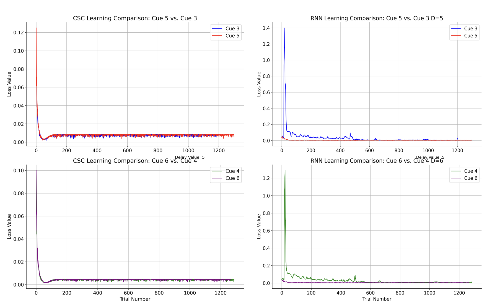
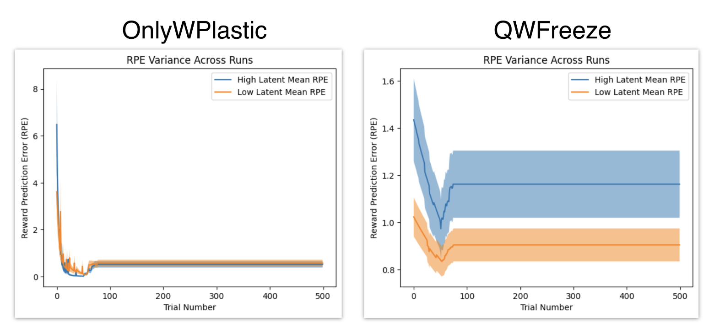

# PSY 2350R: Laboratory on Reinforcement Learning and Decision Making Semester Report
**Author:** Aneesh Muppidi  
**Email:** aneeshmuppidi@college.harvard.edu

## TD Learning and Value RNNs (First Half of the Semester)

### Objective
The primary goal for the first half of the semester was to computationally replicate the "Rapid Learning of Odor–Value Association in the Olfactory Striatum" experiment and to develop computational models to estimate the value of a cue post-onset observation.

### Initial Setup and Experiment Class Creation
- **Experiment Class Creation:** Developed an experiment class allowing customization of parameters such as the number of trials, observations, rewards, reward delays, intervals between cues, and the total number of cues.
- **Visualization Functions:** Implemented functions to create visual representations of the experimental data, aiding in the interpretation of the experiment's dynamics.
- **Controlled Experiment Initiation:** Set up a controlled experiment where the first half included original cues, and in the second half, two original cues were replaced with new ones.

### Model Development and Analysis
- **CSC Representation Model:** Explored the Complete Serial Compound (CSC) representation model, establishing a baseline showing that the learning of novel cues was not faster than that of original cues.
- **Shared CSC Model:** Proposed a shared CSC representation model, which did not perform as expected due to time constraints.
- **Exploration of ValueRNN:** Investigated whether the ValueRNN would exhibit faster learning for new cues. Varied the number of hidden units and observed their effect on learning. Found that beyond a certain threshold of hidden units, the model demonstrated faster learning for new cues.

*Figure 1: A direct comparison of the RPEs for new cues 5 and 6 during learning by the CSC representation model and the ValueRNN. The ValueRNN starts with a much lower loss than the CSC representation model.*

*Figure 2: Loss/RPE learning for original cues 3 and 4 compared to new cues 5 and 6. The ValueRNN learns the new cues faster than the original cues, unlike the CSC model.*

### Advanced Visualizations
Built on initial work by visualizing hidden unit trajectories corresponding to each cue using PCA, both before and after the RNN learned the novel cues. This provided deeper insights into the model's learning dynamics.

### Learnings and Contributions
- Implemented TD learning from scratch.
- Computationally represented experiments.
- Developed and applied an RNN in Pytorch for TD learning.
- Understood the relationship between the ValueRNN's loss function and the TD error.
- Visualized experiments and RNN activity.
- Gained insights into CSC representations.

Contributions included implementation and exploration of models, with Jay providing guidance on broader research questions.

## Q-learning and Go/No-Go Task: Striatum vs Cortex (Second Half of the Semester)

### Transition to Q-learning
Explored rapid learning mechanisms in Q-learning and investigated potential neural correlates in the experimental data.

### Hypotheses
1. **Pre-Learned Q Matrix Hypothesis:** Hypothesized that a Q matrix pre-adapted to cues 1-4 would facilitate faster learning of new cues 5 and 6.
2. **Role of W Matrix Hypothesis:** Posited that the W matrix could efficiently leverage the existing structure in the Q matrix for new mappings of cues 5 and 6.

### Implications of the Hypotheses
1. **Transfer of Learning:** Faster learning of new cues would indicate transfer learning capability.
2. **Efficiency of Q Learning Modification:** Successful learning with a frozen or slowed-down Q matrix would suggest an efficient learning process.
3. **Mapping Efficiency of W:** Quick mapping of new cues by the W matrix would demonstrate adaptability with minimal alteration to the learned strategy.

### Neural Correlates and Model Implementation
Modeled the cortex's role in transforming sensory inputs into abstract representations and the striatum's role in evaluating actions and outcomes.

### OpenAI Gym Implementation
Set up the experiment in an OpenAI Gym environment for precise control, ensuring reproducible results.

### Exploration into Hierarchical Bayesian Meta-learning
Reviewed literature on hierarchical Bayesian meta-learning and considered connections between our work and this approach. Recognized challenges in directly relating our work to hierarchical Bayesian principles.

### Testing Projection Models with Different Presets
Conducted extensive testing with six different presets to analyze learning rates and model performance under various conditions.

#### Presets Description
1. **OnlyWPlastic:** W matrix is plastic; Q matrix's learning rate is zero.
2. **OnlyQPlastic:** Q matrix is plastic; W matrix is an identity matrix.
3. **QWPlastic:** Both W and Q matrices are plastic.
4. **OnlyWPlasticFreeze:** W matrix is plastic; Q matrix is frozen after new cues are introduced.
5. **OnlyQPlasticFreeze:** Q matrix is plastic; W matrix is frozen after new cues are introduced.
6. **QWPlasticFreeze:** Both W and Q matrices are plastic; Q matrix is frozen after new cues are introduced.

#### Testing Pipelines and Observations
1. Comparison of each preset for a single cue at various learning rates.
2. Comparison of learning for old and novel cues across presets at different learning rates.

*Figure 3: Comparison of learning a novel cue vs. an old cue under different presets.*

### Impact of Reduced Latent Internal Representation Dimensionality
Explored how varying the dimensionality of the internal representation affects learning. Found that reducing dimensionality to half the number of input cues could facilitate more efficient learning.

*Figure 4: RPE for learning a novel cue with different internal representation dimensionalities.*

## Learnings and Insights
- Implementing Q-Learning Agent from Scratch: Gained an intuitive grasp of model mechanics and debugging.
- Utilizing Gym for RL Experiments: Found it invaluable for precise experiment control.
- Robust Testing of Models: Understood the importance of comprehensive testing.
- Literature Reviews and Meta Learning: Expanded knowledge and inspired new approaches.
- Development of New Presets and Neural Correlates: Enhanced ability to conceptualize models and understand their neural underpinnings.
- Visualization and its Importance: Learned effective visualization techniques for clear communication of findings.

## Acknowledgements
I would like to express my sincere gratitude to my mentor, Jay, for his invaluable guidance, support, and the generous allocation of his time throughout this semester. Jay's mentoring style encouraged me to ask pertinent questions and engage in critical thinking, which was instrumental in my growth. His advice on effectively visualizing our findings significantly enhanced the presentation and impact of the work.

## Code and Research Logs
My code and research notebook/logs/notes can all be found at this [repo](https://github.com/Aneeshers/PSY2350r).
